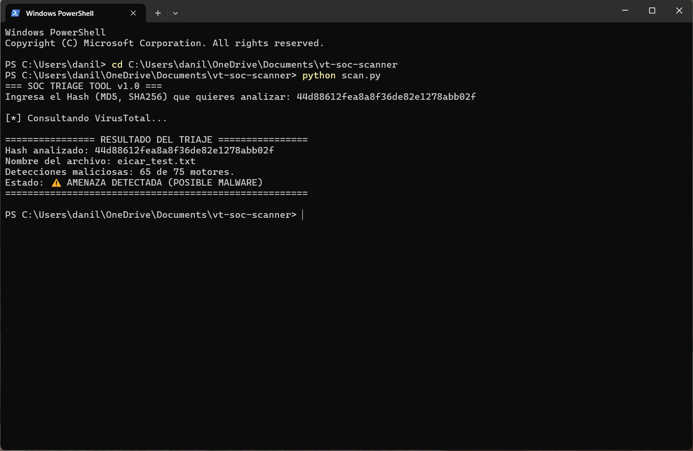
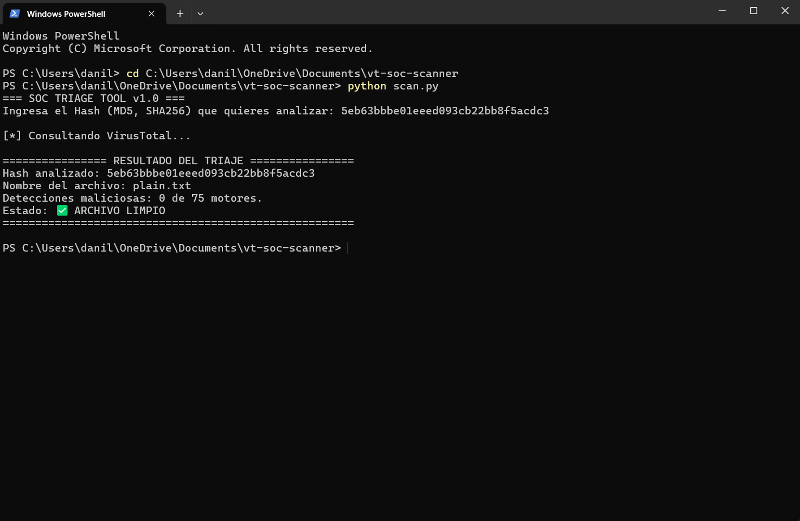

# 🛡️ Lab 1: VirusTotal SOC Triage Tool

Herramienta de automatización desarrollada en Python para Analistas SOC (Nivel 1). Facilita el triaje rápido y consulta de Indicadores de Compromiso (IOCs) consumiendo la API v3 de VirusTotal.

---

## 🚀 Características
- Consulta interactiva de hashes (MD5, SHA256) directamente desde la consola.
- Clasificación automatizada de severidad (Limpio vs. Amenaza Detectada).
- Manejo seguro de credenciales mediante variables de entorno (`.env`) para evitar exposición de API Keys.

---

## 📋 Demostración y Casos de Uso

### 1. Detección de Archivo Malicioso (EICAR Test File)
Evaluación de un hash malicioso con alerta de severidad y detalle de motores activos.



---

### 2. Evaluación de Archivo Limpio
Consulta de un hash verificado sin detecciones en los motores de análisis.



---

## 🛠️ Requisitos e Instalación

1. **Clonar el repositorio:**
   ```bash
   git clone [https://github.com/Daniel-Luques/vt-soc-triage-tool.git](https://github.com/Daniel-Luques/vt-soc-triage-tool.git)
